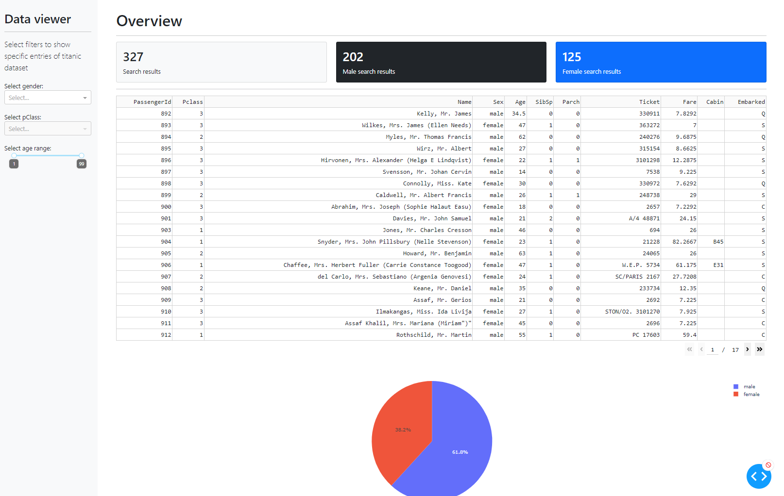

# Dash demo for titanic dataset
## Instructions:
To get started, first clone this repo:

```
git clone https://github.com/RMaier92/Dash_TitanicViewer.git
cd Dash_TitanicViewer
```


Create and activate a conda env:
```
conda create -n dash-titanicviewer python=3.7.6
conda activate dash-titanicviewer
```

Or a venv (make sure your `python3` is 3.6+):
```
python3 -m venv venv
source venv/bin/activate  # for Windows, use venv\Scripts\activate.bat
```

Install all the requirements:

```
pip install -r requirements.txt
```

You can now run the app:
```
python index.py
```

and visit http://127.0.0.1:8050/.


## Demos:


&nbsp;
&nbsp;
&nbsp;

&nbsp;
&nbsp;
&nbsp;
